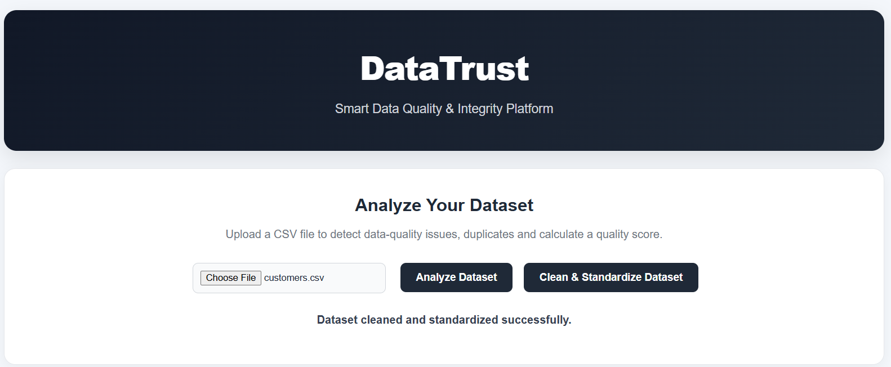
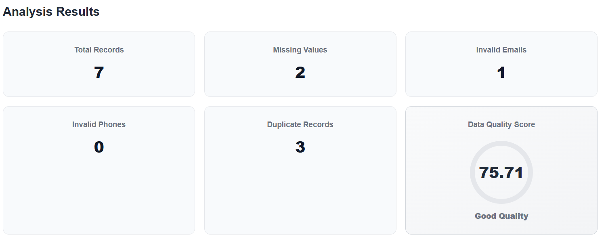
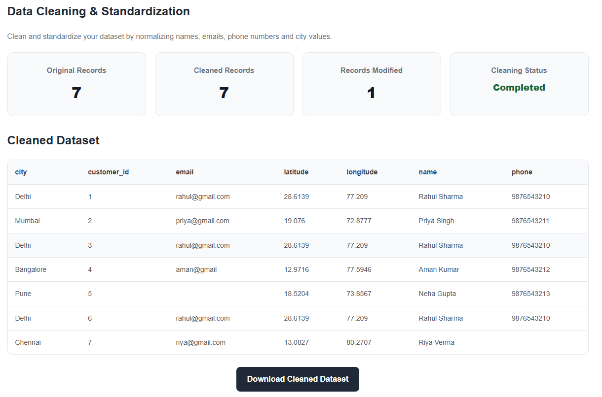
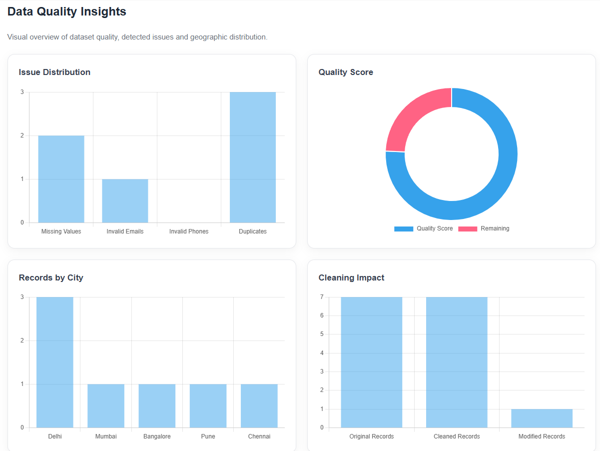

# DataTrust

## Smart Data Quality & Integrity Platform

DataTrust is a web-based data quality and integrity platform designed to help users analyze, validate, clean, standardize, and visualize structured datasets.

The platform allows users to upload CSV datasets, identify data-quality issues, detect duplicate records, calculate an overall data-quality score, visualize geographic information, clean and standardize data, and download the processed dataset.

---

## 🚀 Live Demo

**Live Application:**  
https://datatrust-b3rg.onrender.com

**GitHub Repository:**  
https://github.com/charvi94/DataTrust

> Note: The free Render instance may take a few seconds to wake up after a period of inactivity.

---

## 📸 Screenshots

### Dashboard



The main dashboard provides an overview of the uploaded dataset, including data quality metrics, issue summaries, and available processing operations.

---

### Data Quality Analysis



The Data Quality Analysis section evaluates the dataset and identifies issues such as missing values, invalid emails, invalid phone numbers, and duplicate records.

---

### Data Cleaning & Standardization



The cleaning module standardizes supported fields such as names, emails, phone numbers, and city values.

---

### Data Quality Insights



The insights section provides visual representations of data-quality information to make dataset problems easier to understand.

---

## ✨ Features

- CSV dataset upload
- Data-quality analysis
- Missing-value detection
- Email validation
- Phone-number validation
- Duplicate-record detection
- Data-quality score calculation
- Data-quality issue summary
- Before → After cleaning preview
- Name standardization
- Email standardization
- Phone-number standardization
- City standardization
- Geographic visualization
- Location Intelligence
- Cleaned dataset preview
- Cleaned dataset download
- Interactive dashboard
- SQLite database integration
- Data-quality insights and visualization

---

## 🛠️ Tech Stack

### Frontend

- HTML5
- CSS3
- JavaScript
- Chart.js
- Leaflet.js

### Backend

- Python
- Flask
- Pandas
- NumPy
- Gunicorn

### Data Processing & Validation

- CSV
- Regular Expressions
- Data Validation
- Data Cleaning
- Data Standardization

### Database

- SQLite

### Deployment

- GitHub
- Render

---

## 📂 Project Structure

```text
DataTrust/
│
├── app.py
├── requirements.txt
├── README.md
├── .gitignore
│
├── data/
│   └── customers.csv
│
├── services/
│   ├── cleaner.py
│   ├── database.py
│   ├── duplicate_detector.py
│   ├── quality_scorer.py
│   └── validator.py
│
├── static/
│   ├── css/
│   │   └── style.css
│   │
│   └── js/
│       └── dashboard.js
│
├── templates/
│   └── index.html
│
├── uploads/
│   └── ...
│
├── cleaned/
│   └── ...
│
├── screenshots/
│   ├── dashboard.png
│   ├── analysis.png
│   ├── cleaning.png
│   └── insights.png
│
├── datatrust.db
│
├── db_test.py
├── test.py
└── test_cleaner.py